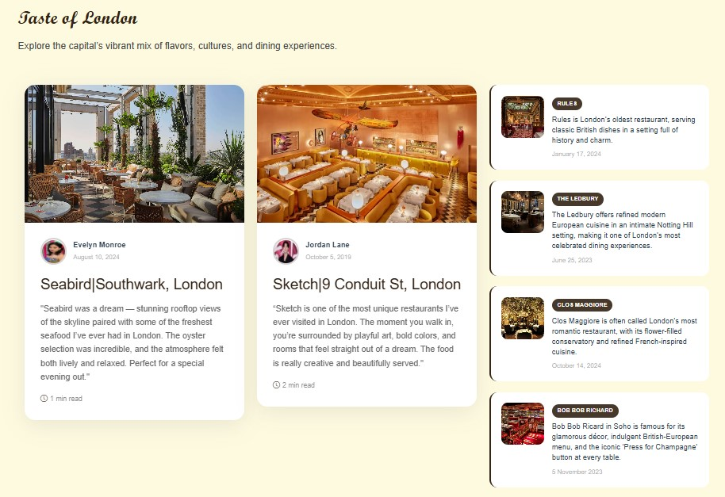

<h1>London Unlocked</h1>
<h2>Project Description</h2>

"London Unlocked" is an interactive webstite developed with the purpose of guiding our user's who are planning their next tript to London. As it's name suggests, it is a website that unlocks the door to a city full of mesmerizing landmarks, flavorful meals, and a few travel tips to be careful about to make their trip even more better. The website also includes reviews from people who have already made their visit, which helps making our website authentic. It helps save time of the new visitors and allows them to enjoy their time fully. In short the website has been developed with a goal to make our user's trip worth the time and money.

<h2>Setup Instruction</h2>
<h3>Step 1: Clone the repository</h3>

The first step to setup the website is to clone the repository to the local machine. In simple terms, cloning refers to making a copy of the remote repository into one's device so that all project files are available to them. For cloning, the following command is to be done: 
        git clone https://github.com/aakiprajapati/website-development 

<h3>Step 2: Open project folder</h3>

After cloning the folder is to be opened using editors such as VSCode. Then the folder "website" should be opened, which should load all of the project files

<h3>Step 3: Open the project</h3>

To view the website, the index.html file should be opened. For real-time preview, the Live Sever extension in VSCode can be utilized.

<h2>Project Contributors</h2>

Aaki Prajapati (https://github.com/aakiprajapati) - Home page, Git setup, Project Report, PowerPoint Presentation, README 

Sulav Shrestha (https://github.com/Sulav306) - About page, Destinations page, Project Report, PowerPoint Presentation 

Arpan Pandey (https://github.com/arpan-pandey)- Contact page, Website Hosting 

Trishala Maharjan (https://github.com/Tichalaa)- Travel Tips page 

Hardik Ghimire (https://github.com/Hardik-Ghimire) - Restaurants page

<h2>Website Screenshots</h2>
<h3>Home Page</h3>

Hero Section

Top Destinations

Restaurants

Travel Tips and Footer

<h3>About Page</h3>

Team Members

Portfolio Demo

<h3>Destinations Page</h3>

Hero Section

Top Destination Sites

<h3>Restaurants Page</h3>

Top Dining Spots

Food Recommendations

<h3>Travel Tips Page</h3>

Travel Tips

<h3>Contact</h3>

Contact Form

Ways to Contact

<h2>Conclusion</h2>

The website “London Unlocked” is a user-friendly and interactive website developed with the purpose of helping the people planning their next visit to London worth their time and money. By incorporating the experiences from people who’ve made their visit, it makes our website authentic and very useful. It includes the top destination sites, places to dine in and travel tips that help save a lot of time and money. The main goal of London Unlocked is to ensure that the London travel becomes a life time experience, totally memorable and worth it. 

